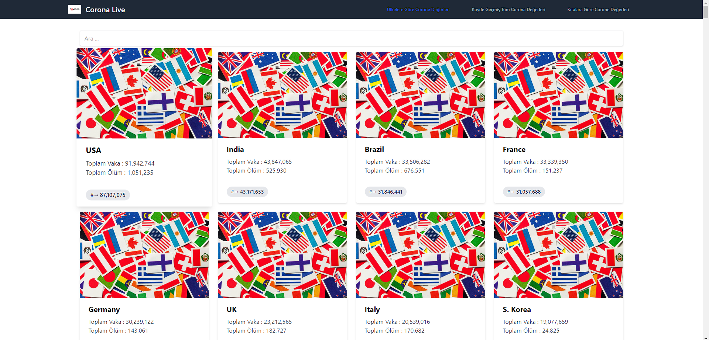
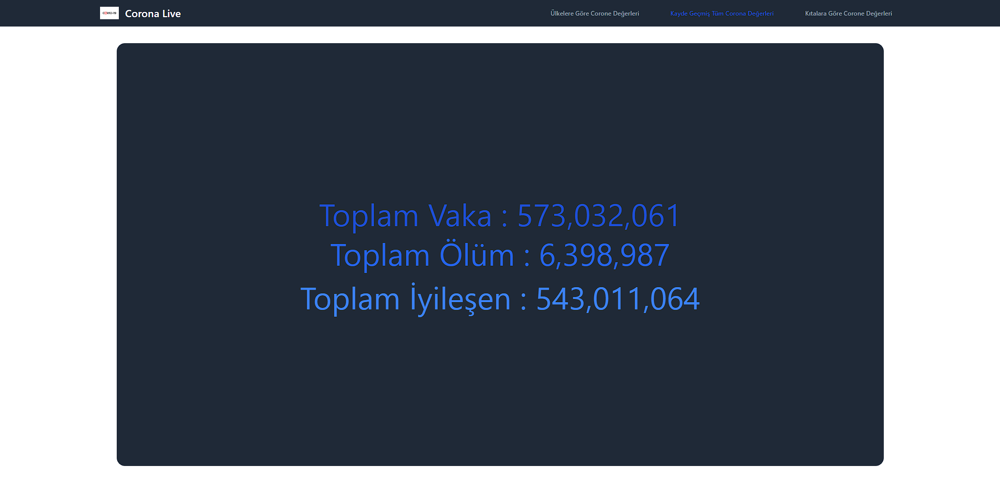

# → React İle API Kullanarak Canlı Covid Uygulaması ←

> ### Proje Link 📎 → https://covidapp-quh258efn-bayazzitt.vercel.app/

<br>

>↓ Uygulama İçi Görsel ↓ 🖼




<br>

>↓ Kullanılan Araçlar ↓ 🛠

* HTML
* Tailwindcss
* REACT.js

<br>

>↓ Kurulum ↓ 🧱

```
npm install
npm install axios
npm start
```

<br>

> → İletişim →  📩 :
> alicanbayazit300@gmail.com
